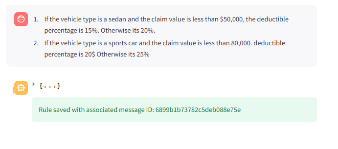
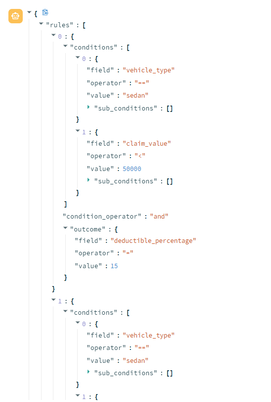

# Streamlit Rule Generator ⚙️

This project, developed as a proof of concept (POC), demonstrates an application that converts natural language business rules into a structured JSON format. It's designed to streamline the process of creating rule sets for automated systems.

\<br\>

## 💡 The Core Idea

The **Rule Generator** acts as a bridge between business users and technical systems. It allows users to write business rules in plain English, which are then interpreted and converted into a machine-readable JSON format by a Large Language Model (LLM). This JSON output can be directly used by downstream systems.

Here's the basic flow:

1.  **Input**: A business user writes a rule in natural language.
2.  **Processing**: A powerful LLM (like GPT-4) parses and understands the rule's logic.
3.  **Output**: A clean, structured JSON rule configuration is generated.

-----

## 🛠️ Features

  - **Model Initialization**: Sets up the GPT-4 model and establishes a connection to the MongoDB database, with both cached for optimal performance.
  - **Rule Generation**: Takes user input and uses GPT-4 to convert natural language into a structured rule.
  - **Database Integration**: Automatically saves generated rules to a MongoDB instance.
  - **Structured Output**: Ensures consistency and reliability using a **Pydantic** output parser to format the JSON.

-----


## 🚀 Example

Let's see how the Rule Generator handles a complex business rule set.




-----

### Natural Language Input

```text
If the vehicle type is a sedan and the claim value is less than $50,000, the deductible percentage is 15%. Otherwise, it’s 20%.
If the vehicle type is a sports car and the claim value is less than $80,000, the deductible percentage is 20%. Otherwise, it’s 25%.
```

### Generated JSON Output

```json
{
  "rules": [
    {
      "conditions": [
        { "field": "vehicle_type", "operator": "==", "value": "sedan", "sub_conditions": [] },
        { "field": "claim_value", "operator": "<", "value": 50000, "sub_conditions": [] }
      ],
      "condition_operator": "and",
      "outcome": { "field": "deductible_percentage", "operator": "=", "value": 15 }
    },
    {
      "conditions": [
        { "field": "vehicle_type", "operator": "==", "value": "sedan", "sub_conditions": [] },
        { "field": "claim_value", "operator": ">=", "value": 50000, "sub_conditions": [] }
      ],
      "condition_operator": "and",
      "outcome": { "field": "deductible_percentage", "operator": "=", "value": 20 }
    },
    {
      "conditions": [
        { "field": "vehicle_type", "operator": "==", "value": "sports car", "sub_conditions": [] },
        { "field": "claim_value", "operator": "<", "value": 80000, "sub_conditions": [] }
      ],
      "condition_operator": "and",
      "outcome": { "field": "deductible_percentage", "operator": "=", "value": 20 }
    },
    {
      "conditions": [
        { "field": "vehicle_type", "operator": "==", "value": "sports car", "sub_conditions": [] },
        { "field": "claim_value", "operator": ">=", "value": 80000, "sub_conditions": [] }
      ],
      "condition_operator": "and",
      "outcome": { "field": "deductible_percentage", "operator": "=", "value": 25 }
    }
  ]
}
```

-----

## 📈 The Value Proposition

This project enables a powerful workflow:

**Document ➡️ Field Extraction ➡️ Rule Engine (JSON) ➡️ Outcomes ➡️ Summary**

By converting unstructured text into a structured rule engine, we can automate decisions based on extracted information, leading to faster and more consistent outcomes (e.g., automated payouts, discounts, or surcharges).

-----

## ⚙️ Installation

To get the app running locally, follow these steps:

1.  **Clone the repository**:

    ```bash
    git clone https://github.com/mohaned-dewedar/output_parsing.git
    ```

2.  **Install dependencies**:

    ```bash
    pip install -r requirements.txt
    ```

3.  **Set up environment variables**:
    Create a `.env` file in the root directory and add your **OpenAI API key** and **MongoDB connection string**.

    ```ini
    OPENAI_API_KEY="your-api-key"
    MONGODB_CONNECTION_STRING="your-mongodb-connection-string"
    ```

-----

## ▶️ Usage

1.  **Run the Streamlit app**:

    ```bash
    streamlit run streamlit_app.py
    ```

2.  **Interact with the app**:

      - Enter a business rule in natural language.
      - The app will use GPT-4 to generate a corresponding JSON rule.
      - The generated rule is then saved to MongoDB and displayed in the app's interface.

-----

## 💻 Tech Stack

  - **[Streamlit](https://streamlit.io/)**: For building the user-friendly web application.
  - **[OpenAI GPT Models](https://openai.com/)**: The core engine for natural language understanding and rule generation.
  - **[MongoDB](https://www.mongodb.com/)**: The database for storing generated rules.
  - **[Python](https://www.python.org/)**: The main programming language for the project.
  - **[Pydantic](https://pydantic-docs.helpmanual.io/)**: Used to ensure the generated JSON output is well-structured and valid.

